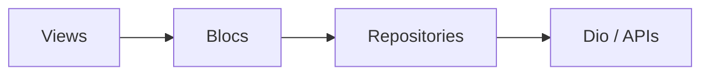

# Ads Dashboard

Flutter client for the marketing specification: campaign list, campaign detail with ML CTR forecast, spend summary, and anomaly alerts with local notifications.

## Requirements

- Flutter stable (3.24+; developed on 3.41)
- Dart 3.11+

## Setup

```bash
cd ads_dashboard
flutter pub get
flutter run
```

## Architecture

- **Presentation:** feature folders under `lib/features/*` with `bloc/` and `view/`.
- **Data:** `lib/data/models`, `datasources` (Dio), and `repositories` (try/catch, user-facing errors).
- **Routing:** `go_router` with `StatefulShellRoute.indexedStack` for four tabs (`lib/router/app_router.dart`).
- **State:** `flutter_bloc` (cubits + one bloc for timed polling).



## APIs

Base URL is defined in `lib/core/config/api_config.dart` (Postman mock from the specification).

## Assumptions

- **CTR on the list screen** uses client-side `clicks / impressions` when impressions > 0; otherwise falls back to API `ctr`.
- **Summary date range** uses query `?days=7|14|30`; the mock may return the same payload for each.
- **Anomaly notifications:** first successful poll establishes a baseline (no spam); later polls notify only for unseen anomaly IDs.
- **Named routes (spec):** implemented as declarative **path-based** `go_router` routes.

## Tests

Includes `test/ctr_helper_test.dart` (pure Dart, no network).

```bash
flutter test
```

